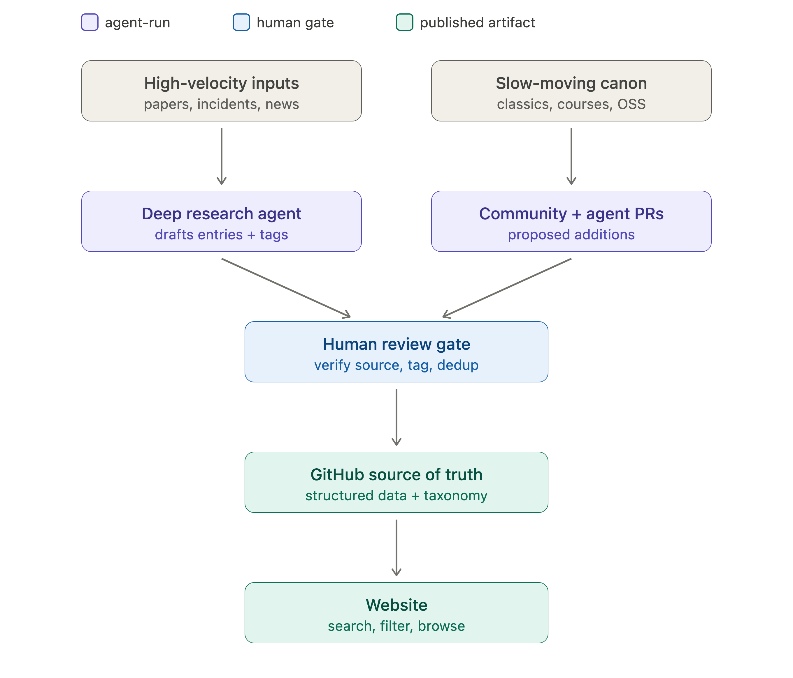

# `data/` — the structured source of truth

This directory is the canonical source of truth for the resource, per the
architecture diagram: **structured data + taxonomy → human review gate → website**.



Each entry is one YAML file:

```
data/<type>/<id>.yml      type in {papers, classics, courses, oss, incidents}
```

Every entry validates against [`schema/entry.schema.json`](../schema/entry.schema.json)
and is tagged against [`taxonomy.yml`](../taxonomy.yml). To add one, copy
[`templates/entry.template.yml`](../templates/entry.template.yml), fill it in, and open a
PR. See [`CONTRIBUTING.md`](../CONTRIBUTING.md).

## Two required facets

Every entry carries two tag facets so the resource maps the field rather than only
listing links:

- **`harness_layer`** — *structural*: where in the agent's operational stack the work
  sits (the 13 README sections). This is how the site and README are organized.
- **`sprs`** — *guarantee*: which system guarantee it serves (Security, Privacy,
  Reliability, Safety). This is the white-paper framework.

## Validation

`python scripts/validate.py` checks schema conformance, taxonomy membership, id dedup,
the publish gate (`reviewed_by` required before `status: published`), the incident
naming gate, and URL resolution. CI runs it on every PR
([`.github/workflows/validate.yml`](../.github/workflows/validate.yml)). Use
`--skip-urls` for a fast offline pass.

## Relationship to `papers/` and `README.md` (in transition)

`data/` is the new single source of truth. The existing `papers/papers.yml` and the
hand-maintained section lists in the top-level `README.md` are being migrated onto it.
Planned follow-ups:

1. **Generate** the top-level `README.md` section lists and `papers/papers.bib` from
   `data/` so the awesome-list view stays in sync automatically.
2. **Rewire** the research agent to draft into `data/papers/drafts/` against this schema.
3. **Build** the website (search / filter / browse by `harness_layer` and `sprs`).
